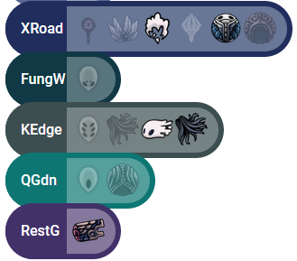

# KHRDreamCatcher
Hollow Knight Randomizer "Quick Mode" App.

## Quick Start:

1. Download the zip file and unzip it.
2. Inside, take the `DreamCatcher.dll` file and move it into your Hollow Knight mods folder.
  - The mods folder will look something like
  `C:\Program Files (x86)\Steam\steamapps\common\Hollow Knight\hollow_knight_Data\Managed\Mods`

**If you want to use the app with OBS...**
1. With OBS open, add a "Browser" source.
2. Check "Local File" and then on the next line Browse and select `dreamcatcher.html` from the unzipped folder.
3. Resize as necessary.  You may want to have it originally at your stream's resolution (eg, 1920x1080).

**If you want to use the app stand-alone...**
1. Open the `dreamcatcher.html` in your favorite browser!